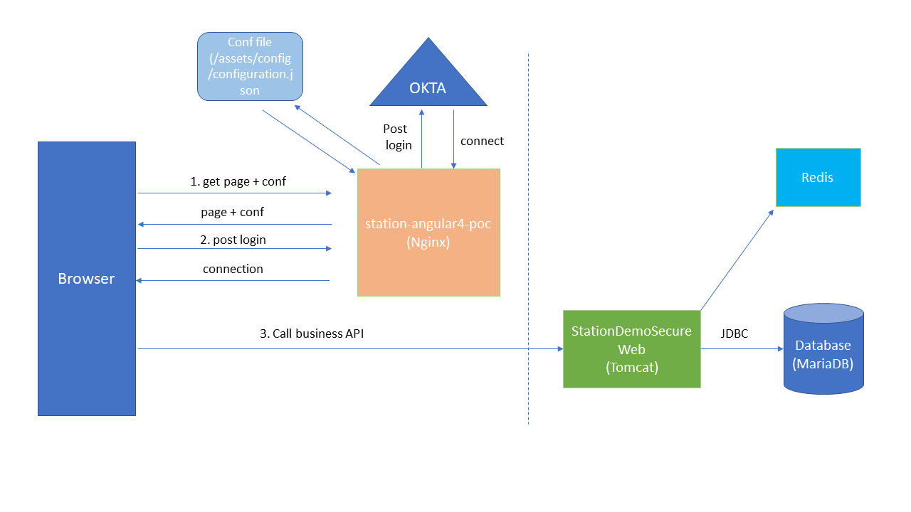

# TrafficStation application demo

This project is a simple CRUD application with a MariaDB or H2 database , it allows to create, delete, update and read traffic station information.
It is based on a file that RATP has made online some years ago (This file is integrated to the database using a batch for the sample).
This project allows me to test some common concept architecture that are used in enterprise. 

# TrafficStation architecture

This project is divided into multiples parts, a web application with the front-end in Angular and the back-end in SpringMVC (Little use also of Spring boot).
I use Okta for identity providing (More easy to manage). I use JWT token for the communication between the front-end and the back-end (Standard in industry).

There is also a batch part made with Spring batch. It calls business part to create some data. 
I use docker for more simplicity and more flexibility and kubernetes (present in the kubernates directory  :), a little  misspelling). Kubernetes will allow 
to manage the number of docker container that will start in the application (Increase or decrease the number depending of the HTTP traffic).
There is 3 docker images in the application :

   - The front-end in Angular using Nginx
   - The back-end in SpringMVC and a little use of Spring boot using Tomcat server
   - The database with MariaDB (Normally we must use a single datasource but for this test, there will be multiple datasources, one per kubernete pod deployed --> Bad practice, I use it only for test), There is also an example with docker-compose
       
Normally, everything must be encrypting with HTTPS but for the POC, I will not do it 

TODO : Improve this architecture schema

# TrafficStation integration

I use maven for java sources and npm for Angular source. I also use a Jenkins container to build all the tasks.
I create 5 tasks : 

   - Build the project, generate docker images and push them in the regular or a custom docker registry
   - Start The application with docker-compose
   - Stop the application with docker-compose
   - Start the application using kubernetes with 2 nodes
   - Stop the application starting with kubernetes.
   
## BuildStationDemoProject

The goal of this job is to build the project and generate docker images and push them in the regular docker registry. 
It takes 2 parameters : 

| Parameter  |  Description |
| ------------ | ------------ |
| VERSION |The version of the project  |
| REPO_NEXUS_URL | The URL of the docker container registry|

## startStationDemoDockerCompose

The goal of this job is to start the application using a docker-compose file. 
It takes 5 parameters : 

| Parameter  |  Description |
| ------------ | ------------ |
| VERSION |The version of the project  |
| REPO_NEXUS_URL | The URL of the docker container registry|
| DATABASE_DATA | The directory where the mariadb data is stored|
| MY_LOGS | The directory where the logs are stored|
| ANGULAR_CONFIG | The directory where the angular configuration file is stored|

## stopStationDemoDockerCompose

The goal of this job is to stop the application using a docker-compose file. 

## startStationDemoKubernete

The goal of this job is to start the application using kubernetes and 2 nodes.
It takes 5 parameters : 

| Parameter  |  Description |
| ------------ | ------------ |
| VERSION |The version of the project  |
| REPO_NEXUS_URL | The URL of the docker container registry|
| DATABASE_DATA | The directory where the mariadb data is stored|
| MY_LOGS | The directory where the logs are stored|
| ANGULAR_CONFIG | The directory where the angular configuration file is stored|
| SERVICE_EXTERNAL_IP | The IP service external IP that is use for the back-end kubernete service |

## stopStationDemoDockerCompose

The goal of this job is to stop the application using kubernetes

 

# TrafficStation organization source

## StationDemoDb

It contains the docker image for the MariaDB datasource, it will create the datasource with existing traffic station of the RATP.

## usinedev

This directory is containing all the tools with docker that will be use for continious integration.

## jenkins

This directory contains all the jenkins pipeline to build, push image into custom or standard docker registry  and deploy the project using docker-compose 
or kubernetes.

## kubernates (A little misspelling)

This directory contains the template to start kubernetes pod and service for the project.
There a 2 instances pod behind a service (Load balancing)

## StationDemoBatch

This component contains all the sources for the batch to integrate the RATP traffic information file of 2015 (I'm not sure of the year), and store it in 
the database (H2 or MariaDB) for the sample. It uses the component StationDemoService to manage traffic station object.

## StationDemoService

This component contains all the services used by traffic station. There is also Junit test to be sure that when we deploy, there is no regression.

## StationDemoWeb

This component contains all the REST service in the back-end part. It is a Java project that will deploy a WAR file for Tomcat. It can deployed with Tomcat.
It is the back-end of the application. It use the component StationDemoService to manage traffic station object.

## StationDemoClient/station-angular4-poc

This component is the front-end of the application base on Angular not AngularJS. It will call the back-end application using JWT token.
It is a CRUD application with a paginating search.

 
