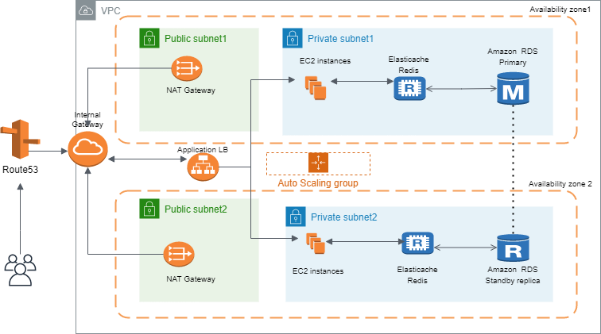

# Station Demo

The architecture of the projet is based on AWS component. This is the AWS architecture schema of the project :  

We use Terraform version 0.15.5
  

   

The StationDemoProject directory is divided into differents parts :

### networks

 - This part is used to create the network part of the project (VPC , subnet, internal Gateway, Route53)

### ecsec2
  
 - This part is used to create all the station based on ECS EC2 and docker image stored in dockerhub of the project Station Demo 

### ecsfargate
  
 - This part is used to create all the station based on ECS fargate and docker image stored in dockerhub of the project Station Demo
 
### eks 
  
 - This part is used to create all the station based on EKS fargate and docker image stored in dockerhub of the project Station Demo
 
### ec2instance 
  
 - This part is used to create a EC2 instance in the private subnet
 
### clusterkubmanual 
  
 - This part is used to create a cluster kubernates manually without using EKS

### stationdb_rds
  
 - This part is used to create the database AWS RDS of the project Station Demo

### stationredis
  
 - This part is used to create the redis cache of the project Station Demo

### efs 
  
 - This part is used to create the EFS storage for the usage of a container docker mysql (If we do not use RDS)

### vars
  
 - This part is used to configure all the environments

